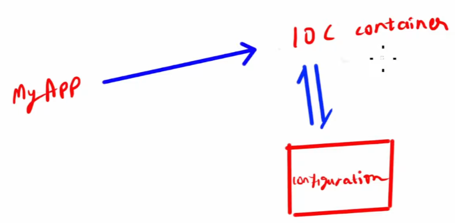
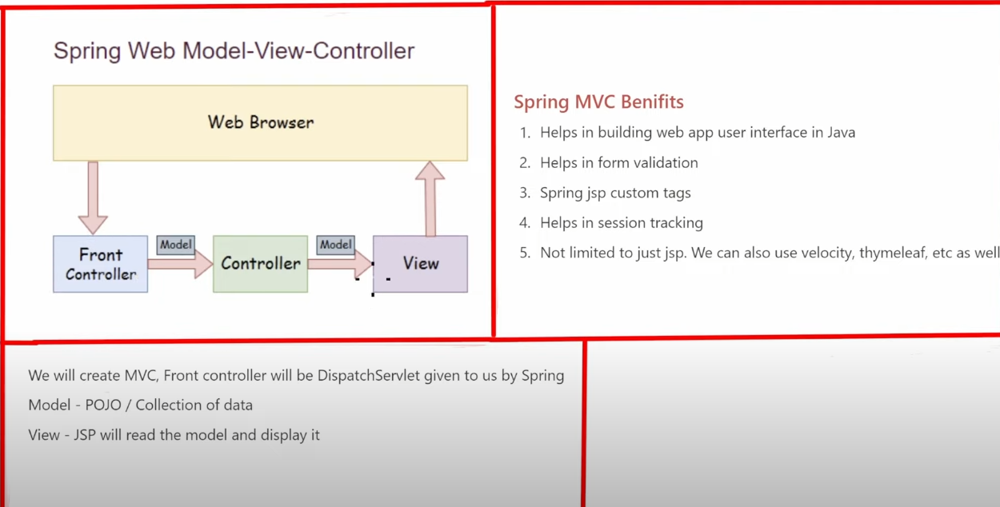

# Spring

In vscode, Ctrl+Shift+P > Spring Initializr > war
Then in App.java, starter code should look like this:

```
package com.aditya;

import org.springframework.boot.SpringApplication;

@SpringBootApplication
@ComponentScan(basePackages = {"com.aditya.demo"})
public class App
{
    public static void main( String[] args )
    {
        SpringApplication.run(App.class, args);

    }
}

```

Then to run the code, use this command in vs code terminal:

```
  mvn srping-boot:run
```

## Table of Contents

- [Spring](#spring) - [What is a Bean in Spring?](#what-is-a-bean-in-spring) - [Key Characteristics of a Bean:](#key-characteristics-of-a-bean) - [JPA (Java Persistence API)](#jpa-java-persistence-api)
  - [Maven](#maven)
    - [pom.xml (Project Object Model)](#pomxml-project-object-model)
  - [Spring](#spring-1)
    - [Why do we need Spring?](#why-do-we-need-spring)
    - [How will Spring do this? IOC Container](#how-will-spring-do-this-ioc-container)
    - [Types of IoC Containers](#types-of-ioc-containers)
  - [Dependency Injection](#dependency-injection)
  - [Injecting literal values into properties](#injecting-literal-values-into-properties)
    - [Another way to Inject literal values](#another-way-to-inject-literal-values)
  - [Bean Scope](#bean-scope)
  - [Annotations](#annotations)
    - [Java Annotations](#java-annotations)
  - [Field Injection (This can only be done through Annotations)](#field-injection-this-can-only-be-done-through-annotations)
    - [Constructor Injection first](#constructor-injection-first)
    - [Setter Injection](#setter-injection)
    - [Field Injection](#field-injection)
  - [Qualifier Annotation](#qualifier-annotation)
  - [Using application.properties using Annotations](#using-applicationproperties-using-annotations)

### What is a Bean in Spring?

In Spring, a bean is an object that is managed by the Spring Inversion of Control (IoC) container. It is essentially a component that Spring creates, initializes, and manages throughout its lifecycle.

### Key Characteristics of a Bean:

Managed by Spring:

Spring controls the lifecycle of the object (creation, dependency injection, destruction, etc.).
Dependency Injection (DI):

Beans can be injected into other beans, reducing tight coupling and making the application more modular and testable.
Defined Through:

Annotations (e.g., @Component, @Service, @Repository, @Bean).
XML Configuration (older approach).

### JPA (Java Persistence API)

It is a set of rules to achieve ORM. Includes interfaces and annotations that you can use in your java classes to implement ORM.
To use JPA, you need a persistence provider. A persistence provider is a specific implementation of the JPA specification. Examples of JPA persistence providers include Hibernate. These providers implement the JPA interfaces and provide the underlying functionality to interact with databases.

- Spring Data JPA is built on top of the JPA specification, but it is not a JPA implementation itself. Instead, it simplifies working with JPA by providing higher level abstractions and utilities. However, to use Spring Data JPA effectively, you still need JPA implementation, such as Hibernate.

## Maven

It is a build management tool, used for defining how your .java files get compiled to .class and then packaged into .jar/.war/.ear files.

**Steps for building software project:**

1. Downloading dependencies
2. Putting additional jars on a classpath, compiling source code into binary code.
3. Running tests.
4. Packaging compiled code into deployable artifacts such as JAR, WAR, and ZIP files.
5. Deploying these artifacts to an application server or repo.
   Apache Maven automates these steps.

Maven uses a set of identifiers:

1. groupId: a unique base name of the company or group that created the project
2. artifactId: a unique name of the project
3. version: a version of the project
4. packaging: a packaging method (eg. WAR/JAR/ZIP)

When we build, jar files are created, which go to the target folder.

### pom.xml (Project Object Model)

The configuration of a Maven project is done via POM. POM describes the project, manages dependencies, and configures plugins for building the software.

## Spring

It is the framework that help the developers to work on their application rather than worrying about non-functional code. So the developer can focus on business logic rather than non-functional requirement.

Basically, Spring is a framework for dependency-injection (it means outsourcing the task of object creation) which is a pattern that allows to build very decoupled systems.

For using spring in Eclipse:

1. Create maven project without archetype
2. In pom.xml, include following dependencies:

```
	<dependency>
	    <groupId>org.springframework</groupId>
	    <artifactId>spring-core</artifactId>
	    <version>5.3.20</version>
	</dependency>
	<!-- https://mvnrepository.com/artifact/org.springframework/spring-context -->
	<dependency>
	    <groupId>org.springframework</groupId>
	    <artifactId>spring-context</artifactId>
	    <version>5.3.20</version>
	</dependency>
```

3. Create a package in src/main/java
4. Create a class in it

### Why do we need Spring?

We normally do:

```
Vehicle vehicle = new Car();
String mileage = vehicle.getMileage();
```

if we want Car ka mileage. If we want Bus ka mileage, we will have to change the code to:

```
Vehicle vehicle = new Bus();
String mileage = vehicle.getMileage();
```

However, if we use Spring, we won't have to change the code humesha.
Spring makes the object configurable. Right now, we are hard-coding the Object as Car() or Bus().

### How will Spring do this? IOC Container


MyApp will contact Spring for object, Spring will check in its configuration, and it will make the object and give it to MyApp.
Particularly in Spring, we will interact with IOC container (Inversion of Control).

- IOC Container is responsible to instantiate, configure and assemble the objects. The IoC container gets informations from the configuration and works accordingly.

- We can configure IoC container in following ways:

1. XML
2. Annotations
3. Java configuration class

### Types of IoC Containers

- The Spring Framework comes with two IoC containers - BeanFactory and ApplicationContext.
- The BeanFactory is the most basic version of IoC containers, and the ApplicationContext extends the features of BeanFactory.
- Use BeanFactory only when memory consumption is critical, otherwise always use ApplicationContext.

- ApplicationContext is a way to implement IoC Containers. We could also say that ApplicationContext is IoC Container.

Configuring IoC container using different ways:

1. Using XML file
   Go to src/main/resources and create an xml file. Paste the boilerplate code there for spring.

```
<?xml version="1.0" encoding="UTF-8"?>
<beans xmlns="http://www.springframework.org/schema/beans"
    xmlns:xsi="http://www.w3.org/2001/XMLSchema-instance"
    xmlns:context="http://www.springframework.org/schema/context" xsi:schemaLocation="
        http://www.springframework.org/schema/beans http://www.springframework.org/schema/beans/spring-beans.xsd
        http://www.springframework.org/schema/context http://www.springframework.org/schema/context/spring-context.xsd">

</beans>
```

Now whenever you write an object, we will use the config file to tell IoC ko ki ye object ye config file se likho.
In Main app,

```
ClassPathXmlApplicationContext context = new ClassPathXmlApplicationContext("config.xml");
```

And in config.xml, we will write beans. Bean is just object in spring lingo. We have to find the fully qualified name of the class who's bean we want to make. To find that in eclipse, go to that class, right click, "Copy qualified name".

```
<bean id="myVehicle" class="com.aystech.vehicles.Bus">
</bean>
```

And now in Main app, we will use this bean, and its id.

```
Vehicle vehicle = context.getBean("myVehicle", Vehicle.class);
System.out.println(vehicle.getMileage());
```

Here, in the getBean, in the second argument we typecasted it to Vehicle so that in the future we can use Bus, Car or whatever and it won't give us an error.

## Dependency Injection

Lets say I have a class Car which extends Vehicle. I want it to use a method of another class DiscountService. Basically, Car is now dependent on DiscountService.

interface DiscountService:

```
package com.aystech.vehicles;

public interface DiscountService {
	public String getDiscountMessage();

}

```

class Car:

```
package com.aystech.vehicles;

public class Car implements Vehicle {

	private DiscountService discountService;

	@Override
	public String getMileage() {

		return "30kmpl";
	}

	@Override
	public String getDiscountMessage() {
		return this.discountService.getDiscountMessage();
	}

}

```

But this will give us an error because we haven't initialized discountService in Car. Initializing this is called Dependency Injection, and we will do that using Spring's beans.
We will create a bean for DiscountService. No, actually, we will create a separate class which implements DiscountService, and create uska bean, since otherwise DiscountService ka class name hi nahi milega nah since its an interface.

```
<bean id="myDiscountService" class="com.aystech.vehicles.FestivalDiscountServiceImpl">
    </bean>
```

Now, dependency ko bean ke andar patak ne ke 3 tareeke hain:

1. Constructor Injection
2. Setter Injection
3. Property Injection

4. Constructor Injection
   In Bus and Car:

```
public Bus(DiscountService discountService) {
		this.discountService = discountService;
	}
```

and in config.xml:

```
<bean id="myVehicle" class="com.aystech.vehicles.Bus">
    	<constructor-arg ref="myDiscountService" />
    </bean>
```

And we are done! Behind the scenes, the IoC will call the constructor that we have created after it finds out in the config that the myVehicle bean's dependency is the other myDiscountService bean.

2. Setter Injection
   Basically getter and setter waala setter banana hai humein.
   In Car class:

```
public void setDiscountService(DiscountService discountService) {
		this.discountService = discountService;
	}
```

Now in config.xml, instead of constructor-arg we will use:

```
<bean id="myVehicle" class="com.aystech.vehicles.Bus">
		<property name="discountService" ref="myDiscountService"></property>
    </bean>
```

Here, in name, write the name of the property in Car. "private DiscountService discountService" waala.

## Injecting literal values into properties

Lets say we have a property: private String brandName; in Car class.
Then go to config.xml,

```
<bean id="myVehicle" class="com.aystech.vehicles.Car">
		<property name="discountService" ref="myDiscountService"></property>
		<property name="brandName" value="Honda"></property>

    </bean>
```

### Another way to Inject literal values

Lets say we have another property called private Double maximumRetailPrice; along with their getters and setters.
Now, in resources, create a new file: car.properties.
In that, write: car.mrp=2000
Now, in config.xml, use this boilerplate:

```
<?xml version="1.0" encoding="UTF-8"?>
<beans xmlns="http://www.springframework.org/schema/beans"
    xmlns:xsi="http://www.w3.org/2001/XMLSchema-instance"
    xmlns:context="http://www.springframework.org/schema/context" xsi:schemaLocation="
        http://www.springframework.org/schema/beans http://www.springframework.org/schema/beans/spring-beans.xsd
        http://www.springframework.org/schema/context http://www.springframework.org/schema/context/spring-context.xsd">
```

And now mention this:

```
<context:property-placeholder location="car.properties" />
<bean id="myVehicle" class="com.aystech.vehicles.Car">
		<property name="discountService" ref="myDiscountService"></property>
		<property name="brandName" value="Honda"></property>
    	<property name="maximumRetailPrice" value="${car.mrp}"></property>
    </bean>
```

## Bean Scope

1. Scope refers to lifecycle of a bean
2. How long does it live?
3. How many instances are created?
4. How is it shared?

There are 5 types of Scope

1. Singleton
2. Prototype
3. Request
4. Session
5. Global-Session
   Here, last three are used in web application.

Vehicle vehicle1= context.getBean("myVehicle",Vehicle.class);
Vehicle vehicle2 = context.getBean("myVehicle",Vehicle.class);
System.out.println(vehicle1==vehicle2);
Here we will get true. Vehicle1 and Vehicle2 point to the same memory in space. This is called Singleton. To make them point to different locations, it is called Prototype.
We can make them Prototype by:

```
<bean id="myVehicle" class="com.aystech.vehicles.Car" scope="prototype">
```

## Annotations

### Java Annotations

1. Provide metadata about class
2. additional info to compiler
3. We can write annotations on method, interface, class, fields.

Now, we will configure using ANNOTATIONS RATHER THAN XML.
In Car class, we will write:
@Component
With this, we are registering this class as a spring bean.
To give it an id, @Component("myCar"). If we don't give ID name, then spring will automatically assign it with id name="car".

In config.xml

```
<context:component-scan base-package="com.aystech.vehicles"></context:component-scan>
```

Now in MySpringApp,

```
package com.aystech.vehicles;
import org.springframework.context.support.ClassPathXmlApplicationContext;
public class MySpringApp {
	public static void main(String[] args) {
		ClassPathXmlApplicationContext context = new ClassPathXmlApplicationContext("config.xml");
		Vehicle bean =context.getBean("myCar", Vehicle.class);
		System.out.println(bean.getMileage());
	}
}
```

## Field Injection (This can only be done through Annotations)

We studied Constructor Injection and Setter Injection earlier using XML. Now there is another method of injection, which is Field Injection which is done through Annotations.

### Constructor Injection first

Procedure is similar, first create a constructor in Car class.

```
@Autowired
	public Car(DiscountService discountService) {
		this.discountService = discountService;
	}
```

Here, we have written Autowired because:

- It is an annotation for Dependency Injection
- Spring then scans for the class/interface with @Component on it.

### Setter Injection

```
@Autowired
	public void setDiscountService(DiscountService discountService) {
		this.discountService = discountService;
	}
```

### Field Injection

Just do this:

```
@Autowired
	private DiscountService discountService;
```

Now, if DiscountService interface has multiple implementations, what will we do? -> Qualifier Annotation.

## Qualifier Annotation

Lets say we have another class NoDiscountServiceImpl which implements DiscountService. And now, we want to use FestivalDiscountServiceImpl for our Car class; then in Car class:

```
	@Autowired
	@Qualifier("festivalDiscountServiceImpl")
	private DiscountService discountService;
```

**NOTE** : If you're using default beanId, then if the first and second letter of the class name is capital, then the beanId will be as it is. Otherwise, it makes the first letter lowercase.

## Using application.properties using Annotations

Previously, we created a file in resources called car.properties, and then injected that into our XML. Now, we will see a better alternative using Annotations.
Lets create a private field called mrp in Cars, along with its getters and setters.

Now, again create car.properties in resources folder, and then include it in config.xml:

```
<context:property-placeholder location="car.properties"/>
```

Now in Car.java

```
@Value("${car.mrp}")
	private int mrp;

```

## Bean Scope but this time using Annotations

By default it is always Singleton.
In Car class:

```
@Component("myCar")
@Scope("prototype")
public class Car implements Vehicle {
```

## Completely Removing XML, using Annotations Only

We will delete the config file and instead create a class called Config.java. Inside this:

```
package com.aystech.vehicles;

import org.springframework.context.annotation.ComponentScan;
import org.springframework.context.annotation.Configuration;

@Configuration
@ComponentScan("com.aystech.vehicles")
public class Config {

}
```

Once we have written @Configuration, IoC container will no longer go to the XML file and instead go to this Config.java file.
@ComponentScan will find components inside the package mentioned in brackets (basically its equivalent to component-scan in xml file earlier)

Now, in MySpringApp, instead of using "ClassPathXMLApplicationContext", we will use:

```
package com.aystech.vehicles;

import org.springframework.context.annotation.AnnotationConfigApplicationContext;

public class MySpringApp {

	public static void main(String[] args) {
		AnnotationConfigApplicationContext context = new AnnotationConfigApplicationContext(Config.class);
		Vehicle vehicle = context.getBean("car", Vehicle.class);
		System.out.println(vehicle.getMileage());
	}

}
```

## Bean Annotation

**NOTE** : This is an alternative to previous above Annotation method (alternative to @Component, @Autowired, etc.). Don't use this.

Earlier, @Component wasn't a thing. So if you're reading some old code, you must know Bean Annotation syntax.
In Config.java:

```
@Bean
	public Vehicle car() {
		Car car = new Car();
		return car;
	}
```

For dependency injection in this: using Constructor injection

```
@Bean
	public Vehicle car() {
		Car car = new Car(festivalDiscountService());
		return car;
	}

@Bean
public DiscountService festivalDiscountService(){
	FestivalDiscountService festivalDiscountService = new FestivalDiscountService();
	return festivalDiscountService;
}
```

For property injection:
In Config.java file itself, under @ComponentScan:
@PropertySource("car.properties")

Now in Car.java

```
@Value("${car.mrp})
private int mrp;

public int getMrp(){
	return this.mrp;
}
```

## Spring MVC
- It is a framework for building web applications in Java which also uses features of Spring like DI (Dependency Injection) and IoC.
- It is based on Model View Controller design pattern.

When we hit a url on the Web browser, first the request goes to the Front Controller. The Front Controller is a DispatchServlet which is given to us by Spring. This will give us a Model which we will then use as request for the Controller. Every url is mapped to a separate controller. For example, fb.com/friends is handled by Controller1, fb.com/search is handled by Controller2. The Controller performs whatever logic it is supposed to do based on the url. The Controller generates a view (jsp page or html page) which we then display on the web browser.

Model is a collection of classes (data). 

### Creating a Spring MVC Project in Eclipse
- Here, select maven archetype spring-mvc.
War plugin:
```
<plugin>
				<groupId>org.apache.maven.plugins</groupId>
				<artifactId>maven-war-plugin</artifactId>
				<version>3.4.0</version>
			</plugin>
```

Follow this video:
- https://www.youtube.com/watch?v=-6EPHbRFgu8&list=WL&index=3
- https://stackoverflow.com/questions/10892790/eclipse-internal-error-while-initializing-java-tooling
- https://stackoverflow.com/questions/15380125/cannot-add-a-project-to-a-tomcat-server-in-eclipse
- https://stackoverflow.com/questions/25087833/tomcat-version-7-0-only-supports-j2ee-1-2-1-3-1-4-and-java-ee-5-and-6-web-mod
- https://stackoverflow.com/questions/19832348/project-facet-java-version-1-7-is-not-supported

