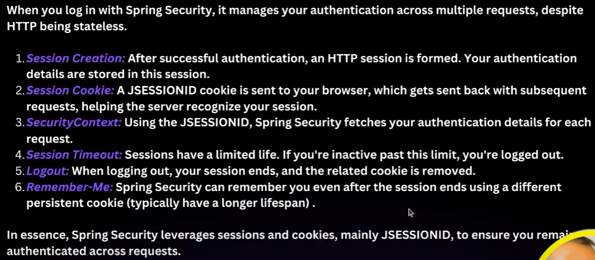
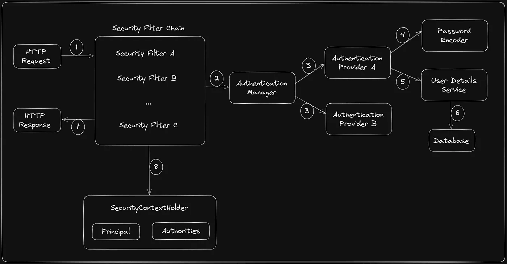

# Spring Boot

- Spring Boot is a framework for building applications in the Java programming language.
- We can create Spring applications using Spring Boot.
- Spring Boot came in order to easily configure and run Spring applications.
- Spring Boot has an already embedded Tomcat server.

- We use the @SpringBootApplication annotation on the main class. This single annotation replaces the need for setting up a manual Spring application context.
- We no longer need to explicitly create an application context using AnnotationConfigApplicationContext as Spring Boot handles that behind the scenes.
- We use SpringApplication.run() to start the application, and Spring Boot takes care of configuring the embedded web server and other necessary components.

## Jar Vs War

Jar = Java Archive.
War = Web Application Archive.
You can run Jar using commands. But for War, you will have to deploy on external web server.

## Maven Lifecycle

1. validate - validate the project is correct and all necessary information is available.
2. compile - compile the source code of the project.
3. test - test the compiled source code using a suitable unit testing framework. These tests should not require the code be packaged or deployed.
4. package - take the compiled code and package it in its distributable format such as JAR.
5. verify - run any checks on results of integration tests to ensure quality criteria are met.
6. install - install the package into the local repository, for use as a dependency in other projects locally.
7. deploy - done in the build environment, copies the final package to the remote repository for

We can run spring boot like this also:

```
mvn package
//then go to target
cd target
//then do ls
ls
//find the packaged jar file. this is a fat jar file which has compiled code + all the relevant dependencies. the original jar file only has compiled code.
java -jar <nameofpackagedfile>
```

mvn install - humare local m2 folder mein jar install karke dega.
mvn clean - target se saari cheezein udd jayegi

## @SpringBootApplication Internal Working

We put @SpringBootApplication only on the main class.
It does three things:

- @Configuration
- @EnableAutoConfiguration
- @ComponentScan : It will do component scan only in the base package.

@Autowired - Used for dependency injection.

@RestController - This is also like Component. It also makes a bean. But it is Component + something else as well. They are special type of Components that can handle HTTP requests.

```
package net.engineeringdigest.journalApp.controller;

import org.springframework.web.bind.annotation.GetMapping;
import org.springframework.web.bind.annotation.RestController;

@RestController
public class HealthCheck {
    @GetMapping("/health-check")
    public String healthCheck(){
        return "Ok";
    }
}

```

With @GetMapping we can map the url to the method.

## Creating REST API using Spring Boot

- Create two packages, controller and entity.
- In Controller, write methods which would get, put, post, delete stuff.
- In Entity, create the classes that you want to create

@RequestMapping("/xyz") - We can put this just below @RestController. Then in that class, all the paths will be prefixed by /xyz/.

**NOTE**: Methods inside a controller class should be public so that they can be accessed and invoked by the spring framework or external http requests.

@PostMapping: In this we will have to pass data to the body. In order to do that, we will include an argument @RequestBody in the method. It's like saying "Hey spring, please take the data from the request and turn it into a java object that I can use in my code".

GetMapping, PostMapping, PutMapping, DeleteMapping, and by Path Variable Example:

```
package net.engineeringdigest.journalApp.controller;
import net.engineeringdigest.journalApp.entity.JournalEntry;
import org.springframework.web.bind.annotation.*;
import java.util.ArrayList;
import java.util.HashMap;
import java.util.List;
import java.util.Map;

@RestController
@RequestMapping("/journal")
public class JournalEntryController {
    private Map<Long, JournalEntry> journalEntries = new HashMap<>(); //since we don't have a database right now

    @GetMapping
    public List<JournalEntry> getAll(){
        return new ArrayList<>(journalEntries.values());
    }

    @PostMapping
    public boolean createEntry(@RequestBody JournalEntry myEntry){
        journalEntries.put(myEntry.getId(), myEntry);
        return true;
    }

    @GetMapping("id/{myId}")
    public JournalEntry getJournalEntryById(@PathVariable Long myId){
        return journalEntries.get(myId);
    }

    @DeleteMapping("id/{myId}")
    public JournalEntry deleteJournalEntryById(@PathVariable Long myId){
        return journalEntries.remove(myId);
    }

    @PutMapping("id/{myId}")
    public JournalEntry updateJournalEntryById(@PathVariable Long myId, @RequestBody JournalEntry myEntry){
        return journalEntries.put(myId, myEntry);
    }
}
```

## MongoDB

Collections - Tables
Fields - columns
Documents - rows

## ORM, JPA, and Spring Data JPA

ORM is a technique used to map Java objects to database tables.

**Java Persistence API (JPA):** A way to achieve ORM, includes interfaces and annotations that you use in your Java classes, requires a persistence provider (ORM tools) for implementation.
We use Hibernate to implement JPA interfaces.

JPA is only used in RDBMS. So we can't use JPA for MongoDB. Instead, we will use "Spring Data MongoDB" for MongoDB.

- **Query Method DSL** and **Criteria API** are two different ways to interact with a database when using Spring Data JPA for relational databases and Spring Data MongoDB for MongoDB databases.

- **Query Method DSL** is a simple and convenient way to create queries based on method naming conventions, while the **Criteria API** offers a more dynamic and programmatic approach for building complex and custom queries.

## Integrating MongoDB to Spring Boot Application

In application.properties:

```
spring.data.mongodb.host=localhost
spring.data.mongodb.port=27017
spring.data.mongodb.database=journaldb
```

### Best Development Practice:

1. Controllers will call services. So all the business logic should be written inside a new package called service. Controllers should just make the endpoints and call service.
2. Make a package called repository which would have all the interfaces.
3. Controller will call service, service will call repository.

Extend the interface to MongoRepository. It has two generics, first is on what you want to query, and second is the type of id.
So for us it will be MongoRepository<JournalEntry, String>
In JournalEntry class, put annotation at the top called: @Document in order to map it to MongoDB collection.

#### Code

Finally, the code for Controller, Service and Repository is as follows:

1. Controller

```
package net.engineeringdigest.journalApp.controller;

import net.engineeringdigest.journalApp.entity.JournalEntry;
import net.engineeringdigest.journalApp.service.JournalEntryService;
import org.bson.types.ObjectId;
import org.springframework.beans.factory.annotation.Autowired;
import org.springframework.web.bind.annotation.*;
import java.time.LocalDateTime;
import java.util.ArrayList;
import java.util.HashMap;
import java.util.List;
import java.util.Map;

@RestController
@RequestMapping("/journal")
public class JournalEntryControllerV2 {

    @Autowired
    private JournalEntryService journalEntryService;

    @GetMapping
    public List<JournalEntry> getAll(){
        return journalEntryService.getAll();
    }

    @PostMapping
    public boolean createEntry(@RequestBody JournalEntry myEntry){
        myEntry.setDate(LocalDateTime.now());
        journalEntryService.saveEntry(myEntry);
        return true;
    }

    @GetMapping("id/{myId}")
    public JournalEntry getJournalEntryById(@PathVariable ObjectId myId){
        return journalEntryService.findById(myId).orElse(null);
    }

    @DeleteMapping("id/{myId}")
    public boolean deleteJournalEntryById(@PathVariable ObjectId myId){
        journalEntryService.deleteId(myId);
        return true;
    }

    @PutMapping("id/{myId}")
    public JournalEntry updateJournalEntryById(@PathVariable ObjectId myId, @RequestBody JournalEntry newEntry){
        JournalEntry old = journalEntryService.findById(myId).orElse(null);
        if(old!=null){
            old.setTitle(newEntry.getTitle()!=null && !newEntry.getTitle().equals("") ? newEntry.getTitle() :  old.getTitle());
            old.setContent(newEntry.getContent()!=null && !newEntry.getContent().equals("") ? newEntry.getContent() : old.getContent());
        }
        journalEntryService.saveEntry(old);
        return old;
    }
}
```

2. Service

```
package net.engineeringdigest.journalApp.service;

import net.engineeringdigest.journalApp.entity.JournalEntry;
import net.engineeringdigest.journalApp.repository.JournalEntryRepository;
import org.bson.types.ObjectId;
import org.springframework.beans.factory.annotation.Autowired;
import org.springframework.stereotype.Component;
import java.util.List;
import java.util.Optional;

@Component
public class JournalEntryService {

    @Autowired
    private JournalEntryRepository journalEntryRepository;

    public void saveEntry(JournalEntry journalEntry){
        journalEntryRepository.save(journalEntry);
    }

    public List<JournalEntry> getAll(){
        return journalEntryRepository.findAll();
    }

    public Optional<JournalEntry> findById(ObjectId myId){
        return journalEntryRepository.findById(myId);
    }

    public void deleteId(ObjectId myId){
        journalEntryRepository.deleteById(myId);
    }
}
```

3. Repository

```
package net.engineeringdigest.journalApp.repository;

import net.engineeringdigest.journalApp.entity.JournalEntry;
import org.bson.types.ObjectId;
import org.springframework.data.mongodb.repository.MongoRepository;

public interface JournalEntryRepository extends MongoRepository<JournalEntry, ObjectId> {
}
```

## Handling HTTP Status while creating REST API

- 1xx (Informational) : These status codes indicate that the request was received and understood, and the server is continuing to process it. These are typically used for informational purposes and rarely seen in practice.
- 2xx (successful) : These status codes indicate that the request was successfully received, understood, and processes by the server.
  - 200 Ok
  - 201 Created: Req fulfilled and new resource has been created as a result.
  - 204 No Content: Req successful, but no response body. (used for successful deletion)
- 3xx (redirection) : these status codes indicate that further action is needed to complete the request. They are used when the client needs to take additional steps to access the requested resource.

  - 301 Moved permanently : requested resource has been permanently moved to diff url
  - 302 Found : the requested resource has been temporarily moved to diff url. server typically sends resp with new temp url where client should redirect to.
  - 304 Not Modified : the client's cached version of the req resource is still valid, so client can use its cached copy.

- 4xx (client error) : These status codes indicate that there was an error on the client's part, such as malformed request or authentication issues.

  - 400 Bad request : invalid syntax or other client side issues
  - 401 Unauthorized : client needs to provide authentication credentials to access the requested resource
  - 403 Forbidden : client is authenticated, but it does not have permission to access the req resource.

- 5xx (Server error) : These status codes indicate that there was an error on the server's part while trying to fulfill the request.
  - 500 Internal Server Error : something went wrong on the server.
  - 502 Bad Gateway : server acting as a gateway or proxy received an invalid response from upstream server.
  - 503 Service Unavailable : server is currently unable to handle the req due to temporary overloading or maintenance.

### ResponseEntity class

- Commonly used in spring boot applications to customize HTTP response.
- Provides methods for setting response status, headers, and body.

```
@GetMapping("id/{myId}")
    public ResponseEntity<JournalEntry> getJournalEntryById(@PathVariable ObjectId myId){
        Optional<JournalEntry> journalEntry = journalEntryService.findById(myId);
        if(journalEntry.isPresent()){
            return new ResponseEntity<>(journalEntry.get(), HttpStatus.OK);
        }
        return new ResponseEntity<>(HttpStatus.NOT_FOUND);
    }
```

So now, the controller code becomes:

```
package net.engineeringdigest.journalApp.controller;

import net.engineeringdigest.journalApp.entity.JournalEntry;
import net.engineeringdigest.journalApp.service.JournalEntryService;
import org.bson.types.ObjectId;
import org.springframework.beans.factory.annotation.Autowired;
import org.springframework.http.HttpStatus;
import org.springframework.http.ResponseEntity;
import org.springframework.web.bind.annotation.*;

import java.time.LocalDateTime;
import java.util.*;

@RestController
@RequestMapping("/journal")
public class JournalEntryControllerV2 {

    @Autowired
    private JournalEntryService journalEntryService;


    @GetMapping
    public ResponseEntity<?> getAll(){
        List<JournalEntry> all = journalEntryService.getAll();
        if(all!=null && !all.isEmpty()){
            return new ResponseEntity<>(journalEntryService.getAll(), HttpStatus.OK);
        }
        return new ResponseEntity<>(HttpStatus.NOT_FOUND);
    }

    @PostMapping
    public ResponseEntity<JournalEntry> createEntry(@RequestBody JournalEntry myEntry){
        try{
            myEntry.setDate(LocalDateTime.now());
            journalEntryService.saveEntry(myEntry);
            return new ResponseEntity<>(myEntry, HttpStatus.CREATED);
        } catch (Exception e){
            return new ResponseEntity<>(HttpStatus.BAD_REQUEST);
        }
    }

    @GetMapping("id/{myId}")
    public ResponseEntity<JournalEntry> getJournalEntryById(@PathVariable ObjectId myId){
        Optional<JournalEntry> journalEntry = journalEntryService.findById(myId);
        if(journalEntry.isPresent()){
            return new ResponseEntity<>(journalEntry.get(), HttpStatus.OK);
        }
        return new ResponseEntity<>(HttpStatus.NOT_FOUND);
    }

    @DeleteMapping("id/{myId}")
    public ResponseEntity<?> deleteJournalEntryById(@PathVariable ObjectId myId){
        journalEntryService.deleteId(myId);
        return new ResponseEntity<>(HttpStatus.NO_CONTENT);
    }

    @PutMapping("id/{myId}")
    public ResponseEntity<?> updateJournalEntryById(@PathVariable ObjectId myId, @RequestBody JournalEntry newEntry){
        JournalEntry old = journalEntryService.findById(myId).orElse(null);
        if(old!=null){
            old.setTitle(newEntry.getTitle()!=null && !newEntry.getTitle().equals("") ? newEntry.getTitle() :  old.getTitle());
            old.setContent(newEntry.getContent()!=null && !newEntry.getContent().equals("") ? newEntry.getContent() : old.getContent());
            journalEntryService.saveEntry(old);
            return new ResponseEntity<>(old, HttpStatus.OK);
        }
        return new ResponseEntity<>(HttpStatus.NOT_FOUND);
    }

}
```

## Project Lombok in Java

- It aims to reduce the boilerplate code that developers have to write, such as getters, setters, constructors, and more.
- It achieves this by generating this code automatically during compilation, based on annotations you add to your Java classes.

  Dependency:

```
<dependency>
			<groupId>org.projectlombok</groupId>
			<artifactId>lombok</artifactId>
			<version>1.18.36</version>
			<scope>provided</scope>
		</dependency>
```

To use it:

```
  package net.engineeringdigest.journalApp.entity;

  import lombok.Getter;
  import lombok.Setter;
  import org.bson.types.ObjectId;
  import org.springframework.data.annotation.Id;
  import org.springframework.data.mongodb.core.mapping.Document;

  import java.time.LocalDateTime;
  import java.util.Date;

  @Document(collection = "journal_entries")
  @Getter
  @Setter
  public class JournalEntry {
      @Id
      private ObjectId id;
      private String title;
      private String content;
      private LocalDateTime date;
  }

```

Or, we can just use @Data annotation. It includes: Getter, Setter, RequiredArgsConstructor, ToString, EqualsAndHashCode, Value.
When using @Data, also include this below it: @NoArgsConstructor

```
@Document(collection = "journal_entries")
@Data
@NoArgsConstructor
```

## MongoDB Relationships

To make a field unique in an entity:

```
@Indexed(unqiue=true)
@NonNull
private String userName; //now userName will become unique, and to make them not be able to become null
```

However this won't be set automatically. To set it automatically, go to application.properties:

```
spring.data.mongodb.auto-index-creation=true
```

Now we are making another entity called User which would have id, username, password, and a list of the particular user's Journal Entries. In order to link the journal entries to the user (like a foreign key):

```
@DBRef
private List<JournalEntry> journalEntries = new ArrayList<>();
```

- The @DBRef annotation is part of Spring Data MongoDB and is used to indicate that a field in our document should be stored as a MongoDB database **reference** rather than being embedded directly in the document. This allows us to establish relationships between documents stored in different collections.
- When a User document stores a reference to a JournalEntry, it saves it as:

```
{
  "$ref": "journal_entries",
  "$id": ObjectId("64b7f7a1f4d7c0a1f8a9c3e5")
}
```

Now, lets say in UserRepository, we want to include a method such that it would automatically find user by userName field. In order to do this, we just have to follow JPA naming convention, and it will automatically do it for us:

```
public interface UserRepository extends MongoRepository<User, ObjectId> {
    User findByUserName(String userName);
}
```

Here, Spring Data JPA parses the method name and generates a query based on the following rules:

findBy → This tells Spring that this is a finder method.
UserName → This maps to the userName field in the User entity.
String userName → The method parameter matches the entity field type.
The generated query would be:

```
SELECT * FROM users WHERE user_name = ?;
```

- Right now in JournalEntryController in our PostMapping, a new journal entry is just being stored in the journal_entries table. But what we want is to also simulataneously add it to that particular user's list of journal entries. In order to do that, in JournalEntryController:

```
    @PostMapping("{userName}")
    public ResponseEntity<JournalEntry> createEntry(@RequestBody JournalEntry myEntry, @PathVariable String userName){
        try{
            journalEntryService.saveEntry(myEntry, userName);
            return new ResponseEntity<>(myEntry, HttpStatus.CREATED);
        } catch (Exception e){
            return new ResponseEntity<>(HttpStatus.BAD_REQUEST);
        }
    }
```

and in JournalEntryService:

```
@Autowired
    private UserService userService;

    public void saveEntry(JournalEntry journalEntry, String userName){
        journalEntry.setDate(LocalDateTime.now());
        User user = userService.findByUserName(userName);
        JournalEntry savedJournal = journalEntryRepository.save(journalEntry);
        user.getJournalEntries().add(savedJournal); //since user.getJournalEntries() will give us a list, we can use add()
        userService.saveEntry(user);
    }
```

- We haven't enabled cascade delete yet. This means that when we delete a journal from the JournalController using the "/journal/id/{myId}", it will get deleted from the journal_entries table, but that entry will remain in the particular user's list of journal entries. We will have to do this manually. 
- Actually, user ke next save par consistency aajayegi, but we want consistency turant hi. That's why we will do it manually.
- In JournalEntryController:
```
@DeleteMapping("id/{userName}/{myId}")
    public ResponseEntity<?> deleteJournalEntryById(@PathVariable ObjectId myId, @PathVariable String userName){
        journalEntryService.deleteId(myId, userName);
        return new ResponseEntity<>(HttpStatus.NO_CONTENT);
    }
```

And in JournalEntryService:
```
public void deleteId(ObjectId myId, String userName){
        User user = userService.findByUserName(userName);
        user.getJournalEntries().removeIf(x -> x.getId().equals(myId)); //this is a loop
        userService.saveEntry(user);
        journalEntryRepository.deleteById(myId);
    }
```

Now for PutMapping, we don't have to do any changes in the user, because uske andar toh JournalEntry ka reference pada hua hai. So we only have to make changes in the journal entry only, which we are already doing. So, what we will do is we will create an overloaded method of saveEntry without the userName parameter. This is because we need the userName parameter for the previous Post and Delete mapping, but we don't need it for Put mapping.

## @Transactional Annotation
- There is still a flaw here. Saving journal in journal_entries and then saving the reference in the user table is not atomic yet. It means that once if the journal is saved in journal_entries, and then some problem occurs due to which the program ends, then the data would not be saved in user entries, which would create inconsistencies. Hence our goal now is to make those two things atomic/transactional.
In main application: 
```
@SpringBootApplication
@EnableTransactionManagement
public class JournalApplication {

    public static void main(String[] args) {
        SpringApplication.run(JournalApplication.class, args);
    }


}
```

In JournalEntryService:
```
@Transactional
    public void saveEntry(JournalEntry journalEntry, String userName){
        journalEntry.setDate(LocalDateTime.now());
        User user = userService.findByUserName(userName);
        JournalEntry savedJournal = journalEntryRepository.save(journalEntry);
        user.getJournalEntries().add(savedJournal);
        userService.saveEntry(user);
    }
```
- Everything below @Transactional will now be treated as one operation, and if any one of them fails, then the entire thing will be rollbacked. Isolation will also be enabled.
- @EnableTransactionManagement finds all those methods which have @Transaction written in them. 
- But now, who will start the transaction and do the rollback? -> Platform Transaction Manager.
- However, PlatformTransactionManager is an interface. Its implementation is -> MongoTransactionManager

- MongoDatabaseFactory helps us to connect with the database. Till now, whatever work we have done, we have done it with the help of this MongoDatabaseFactory's instance only. MongoDatabaseFactory is also an interface. Internally, spring will pass MongoDatabaseFactory's implementation, which is SimpleMongoClientDatabaseFactory.class.

In main application: 
```
@Bean
    public PlatformTransactionManager add(MongoDatabaseFactory dbFactory){
        return new MongoTransactionManager(dbFactory);
    }

```

Here, spring will find which bean is implementing PlatformTransactionManager.
But now, doing so will give us an error: 'Transaction numbers are only allowed on a replica set member or mongos' on server localhost:27017'. This is because we must set replica set members for MongoDB local in order to use Transactions. 
- So now, what we will do is instead we will use MongoDB Atlas, in which they only will configure this for us.

- To make all this cleaner, we can also just create a package called config in our journalApp package. Then create a class in it called TransactionConfig. Annotate it with @Configuration, and with @EnableTransactionManagement.

## MongoDB Atlas
Here, we will create a cluster. Cluster means it will have multiple nodes (means multiple servers across the regions (check locations of nodes)). Due to this, Replication and Sharding will be possible.

- Replication: Same data's copy will be present in other servers. This is so that if one server goes down, then the request can be sent to the other server instead. 
- Sharding: Data will be stored in a distributed manner. Let's say students names are from A to Z, and we have two servers. Then we will evenly distribute the students' names on the basis of a key (which will be their name). 
Lets say our database has 10 students, 5 starting with A, and 5 with B. Then A waale students will be in one server, and B waale students will be on another server.

Why is Sharding Needed?
When a database grows too large, a single machine may struggle with:

1. Storage Limits – A single server might not be able to store all data.
2. Slow Queries – Too much data on one machine slows down reads/writes.
3. High Load – Too many users accessing a single database can create bottlenecks.
Sharding solves these issues by splitting data across multiple shards (servers), allowing: 
✅ Parallel processing of queries
✅ Efficient storage distribution
✅ Faster reads & writes

Types of Sharding
1. Range-Based Sharding: Data is divided based on a range of values (e.g., User ID 1-1000, 1001-2000, etc.).
Easy to implement but shards may become unbalanced if some ranges grow faster.

2. Hash-Based Sharding: Uses a hash function to distribute data across shards randomly.
Prevents hotspots (uneven load) but requires consistent hashing for scalability.

3. Geographical Sharding: Data is sharded based on location (e.g., users in the US on one shard, Europe on another).
Good for reducing latency in global applications.

## Spring Security 
It is a powerful and highly customizable security framework that is often used in Spring Boot applications **to handle authentication and authorization.**

Authentication: Authentication is about verifying identity. [Who are you?]
Authorization: It is about permissions—once you're authenticated, what are you allowed to do? [What can you do?]

Authentication comes first, then authorization

### Configuration
```
<dependency>
	<groupId>org.springframework.boot</groupId>
	<artifactId>spring-boot-starter-security</artifactId>
</dependency>
```
- Once the dependency is added, Spring Boot's auto-configuration feature will automatically apply security to the application.
- By default, Spring Security uses HTTP Basic Authentication.
- Means, the client sends an Authorization header ```Authorization:Basic<encoded-string>```. The server decodes the string, extracts the username and password, and verifies them. If they're correct, access is granted. Otherwise, an "Unauthorized" response is sent back.

Encoding: Credentials are combined in a string like ```username:password``` which is then encoded using Base64.
- By default, all endpoints will be secured. Spring Security will generate a default user with a random password that is printed in the console logs on startup. With that user and password you will have access to all endpoints. 
- But what we want is customized authentication.

@EnableWebSecurity: This annotation signals Spring to enable its web security support. This is what makes your application secured. It's used in conjunction with @Configuration.

SecurityConfig extends WebSecurityConfigurerAdapter: WebSecurityConfigurerAdapter is a utility class in the Spring Security framework that provides default configurations and allows customization of certain features. By extending it, **you can configure and customize Spring Security for your application needs.**

Lets create a package "config" inside main package, and create a class called "SpringSecurity".

```
package net.engineeringdigest.journalApp.config;

import org.springframework.context.annotation.Configuration;
import org.springframework.security.config.annotation.web.builders.HttpSecurity;
import org.springframework.security.config.annotation.web.configuration.EnableWebSecurity;
import org.springframework.security.config.annotation.web.configuration.WebSecurityConfigurerAdapter;

@Configuration
@EnableWebSecurity
public class SpringSecurity extends WebSecurityConfigurerAdapter {

    @Override
    protected void configure(HttpSecurity http) throws Exception {
        http.authorizeRequests()
                .antMatchers("/hello").permitAll()
                .anyRequest().authenticated()
                .and()
                .formLogin();
    }
}
```

configure method in WebSecurityConfigurerAdapter: This method provides a way to configure how requests are secured. It defines how request matching should be done and what security actions should be applied. 

- http.authorizeRequests(): this tells Spring Security to start authorizing the requests.
- .antMatchers("/hello").permitAll(): this part specifies that HTTP requests matching the path /hello should be permitted (allowed) for all users, whether they are authenticated or not. 
- .anyRequest().authenticated(): this is a more general matcher that specifies any request (not already matched by previous matchers) should be authenticated, meaning users have to provide valid credentials to access these endpoints.
- .and(): this is a method to join several configurations. It helps to continue the configuration from the root (HttpSecurity).
- .formLogin(): This enables form-based authentication. By default, it will provide a form for the user to enter their username and password. If the user is not authenticated and they try to access a secured endpoint, they'll be redirected to the default login form. 

You can access /hello without any authentication. However, if you try to access another endpoint, you will be redirected to a login form.

- When we use the .formLogin() method in our security configuration without specifying .loginPage("/custom-path"), the default login page becomes active.
- Spring Security provides an in-built controller that handles the /login path. This controller is responsible for rendering the default login form when a GET request is made to /login.
- By default, Spring Security also provides logout functionality. When .logout() is configured, a POST request to /logout will log the user out and invalidate their session.
- Basic Authentication, by its design, is stateless.



### We want users to now be able to see ONLY their OWN entries
We want our Spring Boot application to authenticate users based on their credentials stored in a MongoDB database.

This means that our users and their passwords (hashed) will be stored in MongoDB, and when a user tries to log in, the system should check the provided credentials against what's stored in the database.

Spring Security Structure:


Steps to implement this:
1. A User entity to represent the user data model
```
@Document(collection = "users")
@Data
public class User {
    @Id
    private ObjectId id;
    @Indexed(unique = true)
    @NonNull
    private String userName;
    @NonNull
    private String password;
    @DBRef
    private List<JournalEntry> journalEntries = new ArrayList<>();
    private List<String> roles;
}
```
2. A repository UserRepository to interact with MongoDB.
```
public interface UserRepository extends MongoRepository<User, ObjectId> {
    User findByUserName(String userName);
}
```
3. UserDetailsService implementation to fetch user details.

For this, we will create a new class in service package, UserDetailsServiceImpl
```
@Component
public class UserDetailsServiceImpl implements UserDetailsService {

    @Autowired
    private UserRepository userRepository;

    @Override
    public UserDetails loadUserByUsername(String username) throws UsernameNotFoundException {
        User user = userRepository.findByUserName(username);
        if(user!=null){
            return org.springframework.security.core.userdetails.User.builder()
                    .username(user.getUserName())
                    .password(user.getPassword())
                    .roles(user.getRoles().toArray(new String[0]))
                    .build();
        }
        throw new UsernameNotFoundException("User not found with username: " + username);
    }
}
```
4. A configuration SecurityConfig to integrate everything with Spring Security.
```
@Configuration
@EnableWebSecurity
public class SpringSecurity extends WebSecurityConfigurerAdapter {

    @Autowired
    private UserDetailsServiceImpl userDetailsService;

    @Override
    protected void configure(HttpSecurity http) throws Exception {
        http.authorizeRequests()
                .antMatchers("/journal/**").authenticated()
                .anyRequest().permitAll()
                .and()
                .httpBasic();
    }

    @Override
    protected void configure(AuthenticationManagerBuilder auth) throws Exception {
        auth.userDetailsService(userDetailsService).passwordEncoder(passwordEncoder());
    }

    @Bean
    public PasswordEncoder passwordEncoder(){
        return new BCryptPasswordEncoder();
    }
}
```

